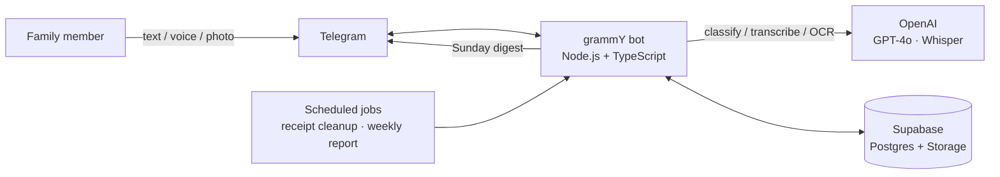

# Finance Bot

A family budget bot that removes every excuse not to log a transaction: text it,
say it, or photograph the receipt — AI does the rest.

## The problem

Expense trackers fail for one boring reason: logging a transaction takes longer
than the transaction itself. Open an app, pick a category, type the amount —
most people quit within a week. This bot collapses that into one message: send
"coffee 3.5", a voice note, or a photo of a receipt, and it's categorized and
saved in seconds. No menus, no forms, no app to open.

## What it does

- **Text, voice, or receipt photo** — one AI pipeline handles all three. A
  voice note is transcribed (Whisper) and fed through the same classifier as
  typed text.
- **Multiple transactions in one message** — "coffee 3.5, taxi 12" is parsed
  into two separate, correctly categorized entries.
- **Receipt scanning** — reads a photo of a real paper receipt (tested against
  Montenegrin store receipts), splits it into individual line items, assigns
  each its own category, and translates product names to Russian. The photo
  itself is kept for 30 days as an audit trail, then auto-deleted — the
  transactions it produced stay forever.
- **Self-checking AI** — low-confidence category calls trigger an inline-button
  follow-up instead of guessing; receipts are read twice independently and
  flagged if the two reads disagree, even when the totals happen to match.
- **Reports** — a `/report` command (month-to-date income vs. goal, spend by
  category, running balance) plus an unprompted weekly digest pushed every
  Sunday.
- **Shared family budget** — every family member sees the same data; anyone
  not on the allow-list is silently ignored.

## Architecture



The bot runs a single long-polling process — no inbound ports, no webhook, no
public URL. All state lives in Supabase; the container itself is stateless and
disposable.

## Engineering highlights

A few things worth a second look if you're evaluating this for an AI
automation role:

- **Caught a real float-precision bug via tests, not in production.** A
  sum-mismatch check compared raw floats against a threshold; `24.17 - 24.12`
  is `0.050000000000071` in IEEE754, not `0.05`. A unit test written to prove
  the "within tolerance" case caught it before it ever shipped.
- **Dual-read consistency check for vision OCR.** Receipt photos are read
  twice, independently, and compared — this caught a case where two adjacent,
  visually-similar line items were silently merged by the model while the
  item sum still happened to match the receipt total, which a naive sum-check
  alone would have missed entirely.
- **Atomic `/undo` via a Postgres function**, replacing an earlier
  client-side select-then-delete that had a race window between the two
  round trips.
- **Deploy-time bug found and fixed live**: Docker containers default to UTC
  regardless of the host's timezone — would have silently shifted the Sunday
  report by two hours. Caught during the actual VPS deploy, not in code
  review.

## Tech stack

| | |
|---|---|
| Runtime | Node.js + TypeScript |
| Bot framework | [grammY](https://grammy.dev/) |
| Database & storage | [Supabase](https://supabase.com/) (Postgres + private file storage, RLS enabled) |
| AI | OpenAI — GPT-4o-mini (text classification), GPT-4o (receipt OCR), `gpt-4o-transcribe` (voice), structured JSON-schema outputs |
| Validation | [Zod](https://zod.dev/) |
| Testing | Node's built-in test runner (`node:test`) — 32 tests, zero extra dependencies |
| Deployment | Docker + Docker Compose on a self-managed Ubuntu VPS |

## Quickstart

```bash
cp .env.example .env   # fill in your own Telegram/OpenAI/Supabase keys
npm install
npm run dev
```

```bash
npm test     # run the test suite
npm run lint # eslint
```

Full production deployment steps (VPS setup, one-command redeploy, log
tailing, auto-restart) are documented further down in this file.

## Screenshots & demo

<!-- TODO: add a screenshot of a text expense being logged and categorized -->
<!-- TODO: add a screenshot of the receipt-scan confirmation screen -->
<!-- TODO: add a screenshot or short screen recording of /report -->

This is a private family bot handling real financial data, so it isn't open
for public use — screenshots and a short demo recording above stand in for
live access.

## Status

✅ Feature-complete MVP, deployed and running on a production VPS.

See `CLAUDE.md` for the full project history, conventions, and known
trade-offs.

## Deployment (Ubuntu VPS)

The bot uses Telegram long polling, not webhooks, so the VPS needs no open
inbound ports, no domain, and no TLS certificate — only outbound internet
access.

**One-time server setup (manual):**

```bash
# install Docker + Compose plugin
curl -fsSL https://get.docker.com | sh
sudo usermod -aG docker $USER
# log out and back in for the group change to take effect
```

**First deploy (manual):**

```bash
git clone https://github.com/Zexstor/finance-bot.git
cd finance-bot
cp .env.example .env
nano .env   # fill in production secrets
docker compose up -d --build
```

**Every later deploy (automated via script):**

```bash
./scripts/deploy.sh
```

This pulls the latest code, rebuilds the image, and restarts the container.

**Logs, one command:**

```bash
docker compose logs -f --tail=100 bot
```

**Auto-restart:** `restart: unless-stopped` in `docker-compose.yml` restarts the bot
if it crashes or the VPS reboots (as long as the Docker daemon itself is enabled on
boot, which `get.docker.com` sets up by default).
